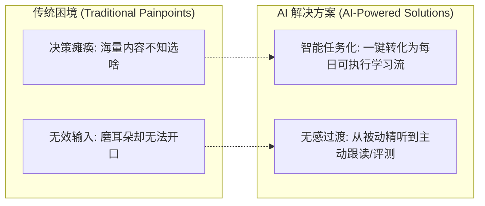
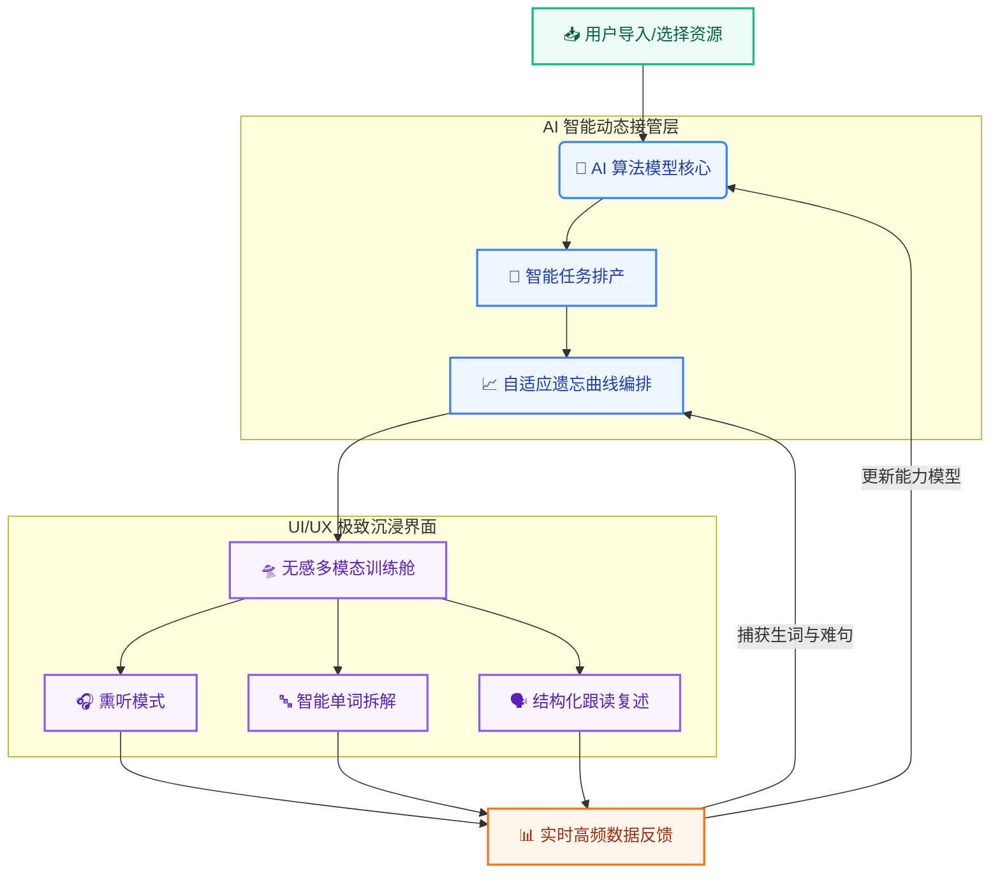

# EnglishGo!

<p align="center">
  <strong>English Go！ --- AI 算法模型驱动的「无感」自适应英语学习舱</strong>
</p>

<p align="center">
  
  
  
  
  <a href="https://qm.qq.com/q/aLMfD4gjtK"></a>
</p>

---

<p align="center">
  
</p>
<p align="center">
  <a href="https://qm.qq.com/q/aLMfD4gjtK">
    
  </a>
</p>

## `EnglishGo!` 并非一款简单的英语音视频播放器应用，也不是机械低效的背单词工具。它是一款由 **进步型 AI 算法模型核心驱动** 的深度学习软件。它打破了传统学习中“内容、练习、复习”彼此割裂的现状，将课程、音频、动态字幕、多维练习、生词库及复习曲线全自动无缝串联，为你打造一个**无感过渡、自适应循环**的闭环学习生态。

---

## 💡 为什么开发 EnglishGo! ？

在决定开发 `EnglishGo!` 之前，我们深入观察了无数英语自学者的真实困境。我们发现，市面上绝大多数产品都在贩卖**“内容焦虑”**，却放任用户坠入两个最隐蔽、也最致命的自学恶性循环。

你一定经历过这种无力感：
*   **精力被过度消耗**：刚打开某款“神级”英语 App，广告和会员弹窗先糊你一脸。想安静听节课，却要绕过积分商城、打卡挑战、社交返利，在密密麻麻的红点里寻找播放键。学个习，比戒手机还难。
*   **被迫接受“不够自律”的指责**：坚持不下去时，软件会冷冰冰地提醒你——是你“不够自律”。

> [!IMPORTANT]
> **真相是：你的意志力在学习还没开始前，就已被繁琐的界面、反人性的交互选择、以及“今天学什么”的决策内耗彻底榨干了。** 你不是不自律，你只是在无谓地消耗精力。

因此，我们设计了 `EnglishGo!`，它的核心理念只有八个字：**清晰不杂乱，温和而克制**。

*   **⚡ 终结内耗（把规划交给算法）**：你不用纠结今天学什么。把材料扔进去，AI 自动完成断句、任务排产，并根据遗忘曲线算好你今天该练哪几句。你只需要“无脑跟”。
*   **🛸 卸下负担（专注沉浸式输入输出）**：砍掉所有花哨的商业套路、复杂的商业诱导与混乱的红点。我们只留下一个纯净的**“无感训练舱”**，让你不知不觉中从盲听过渡到跟读与复述。

在这个浮躁的数字世界里，`EnglishGo!` 旨在为真正想扎扎实实提升自己的自学者，留一片**干净、纯粹、高频反馈的英语学习净土**。

> [!TIP]
> **你不是坚持不下来。这一次，把节奏交给 EnglishGo!。让我们携手同行，在前行的路上，你只管沉浸其中。**

---

## 🎯 我们的使命：弥合两大核心断层

在传统的英语自学路径中，用户常常陷入两个致命的断层。`EnglishGo!` 的核心使命，便是以 **AI 技术** 彻底解决它们：



*   **⚡ 解决“决策瘫痪” ➔ 智能任务化**
    AI 算法自动解构你导入或选择的音频/视频内容，将其一键转化为高度可执行的、每日渐进式的个性化学习流。
*   **🔄 解决“无效输入” ➔ 输入到输出的“无感过渡”**
    利用自适应算法，在不知不觉中引导你从“盲听/精听”的被动输入，平滑过渡到“跟读、复述、多维评测”的主动输出训练，真正实现学以致用。

---

## 📱 全端开发进度看板 (Multi-Platform Progress)

为了打造绝对一致的“无感闭环学习生态”，`EnglishGo!` 正在全力推进全生态端侧的齐头并进。目前客户端整体综合进度已达 **88%**，各端侧详细迭代进度如下：

| 目标端侧 (Platform) | 核心适配特性 / 专属优化 | 开发状态 (Status) | 实时进度 (Progress) |
| :--- | :--- | :---: | :--- |
| ** iOS (iPhone)** | 原生 SwiftUI 高保真重构、适配“Liquid Glass”流体玻璃美学、端侧动态字幕实时渲染与 Haptic 触觉反馈。 | `🟢 Beta测试` | `███████████████████░` **95%** |
| ** iPadOS (iPad)** | 深度适配 iPad 分屏与台前调度（Stage Manager）、针对 Apple Pencil 随手记与跟读标记行为优化。 | `🟡 核心联调` | `█████████████████░░░` **85%** |
| ** macOS (Mac)** | Apple Silicon 芯片原生编译、完美适配 MenuBar 轻量级唤醒模式、深度优化后台多模态训练舱能耗开销。 | `🟡 核心联调` | `████████████████░░░░` **80%** |
| **🤖 Android (安卓)** | 基于现代抽象化设计自适应布局，兼容主流折叠屏与高刷旗舰，联调端侧动态字幕的底层音频同步内核。 | `🔵 开发中` | `███████████████░░░░░` **75%** |
| **🇨🇳 HarmonyOS (鸿蒙)** | 鸿蒙原生 NEXT 架构设计完成，已通过核心 AI 任务排产算法在下一代系统上的可行性验证，预计 2026.Q4 启动封版。 | `⚪ 规划中` | `████░░░░░░░░░░░░░░░░` **20%** |

### 🛠️ 为什么全端开发进度能如此高效？

我们采用了**解耦的跨平台架构设计**：

1.  **🧠 核心算法层 (Core Engine)**
    统一的 AI 算法中枢（任务排产、自适应遗忘曲线）完全沉淀在高性能底层内核中，各平台客户端共用同一套底层核心逻辑，确保学习数据和复习曲线在多端同步时绝无断层。
2.  **🎨 原生表现层 (Native UI)**
    UI 表现层完全原生化。在 Apple 生态坚持使用原生 **SwiftUI** 雕琢极具呼吸感的界面；在 Android 与鸿蒙端采用最契合其系统的现代原生布局，拒绝任何粗暴低效的“套壳”方案，保证每一端都拥有最丝滑的性能与交互体验。

---

## 🚀 核心训练体验：AI 驱动的闭环回路

在 `EnglishGo!` 中，你无需刻意思考“接下来做什么”。一次标准的学习心流将如呼吸般自然发生：

```
[ 资源导入/选择 ] ➔ [ AI 智能排产 ] ➔ [ 熏听/跟读/生词/交互 ] ➔ [ 难句/生词捕获 ] ➔ [ AI驱动自适应无感练习/复习 ]
```

*   **🎯 自适应规划（算法接管）**
    进入课程后，AI 核心会根据你当前的能力模型与遗忘曲线，为你精准派发今日的最优训练任务，拒绝漫无目的地挑选。
*   **🔄 无感多模态切换（动态交互）**
    系统将依据你的听写正确率与跟读表现，在**盲听、精听、单词拆解、结构练习**等模式间动态切换。拒绝机械地“刷进度”，确保每一次交互都是**伴随高频反馈的有效练习**。
*   **💾 数据留痕与精准复现（漏斗捕获）**
    所有在训练中暴露的生词、难句和语法盲点都将被自动捕获并记录归档，在后续的复习流中以最高优先级自动重新编排回练。



---

## 📢 加入内测创始用户群

想要获取最新内测技术预览版，欢迎加入我们的创始用户群：

<p align="center">
  <a href="https://qm.qq.com/q/aLMfD4gjtK" target="_blank">
    
  </a>
</p>

<p align="center">
  <a href="https://qm.qq.com/q/aLMfD4gjtK">
    
  </a>
</p>

> [!NOTE]
> *数据更新于：2026.06。创始内测群内将定期发布 TestFlight 兑换码、纪念品、终身授权以及 Android/鸿蒙 内测安装包和beat特权。*

---

## 📅 路线图与发布计划 (Roadmap)

目前项目正处于高频迭代的冲刺阶段，整体综合开发进度已完成 **95%**。以下是明确的时间里程碑：

*   **[已完成] 🎯 核心算法打通 (2025.Q4)**
    完成 AI 智能任务排产与自适应动态复习的底层逻辑构建。
*   **[进行中] 🎨 界面高保真重构 (2026.Q1 - Q2)**
    进行 iOS、iPadOS、Android 端的全新 UI/UX 重构，引入更具现代抽象化设计的自适应布局。
*   **[即将到来] 🚀 独家内测启动 (2026.06 - 07)**
    预计于 2026 年 7 月开启首轮 TestFlight 独家内测与 Android 首版测试。
*   **[正式发布] 📦 核心应用上架 (2026.07 - 08)**
    预计于 2026 年第三季度正式登陆 Apple App Store 与 Google Play。
*   **[全端打通] 🌐 全生态端互通 (2026.10)**
    预计于 2026 年第四季度前完成 iOS、iPadOS、macOS、Android、HarmonyOS 端的全量上架与云端多端同步打通。

---

## 🛠️ 当前开发进度 (Development Status)

| 核心模块 | 功能详情 | 状态 | 进度 |
| :--- | :--- | :---: | :--- |
| **🧠 AI 驱动核心** | 智能任务排产、多模态无感切换算法 | `🟢 Done` | `████████████████████` **100%** |
| **🔄 核心训练流** | 熏听/练习自适应切换、端侧动态字幕同步 | `🟢 Done` | `████████████████████` **100%** |
| **🎨 UI/UX 重构** | 首页高保真静态图重构、2.5D 微立体图标设计 | `🟡 In Progress` | `██████████████░░░░░░` **70%** |
| **💾 数据与复习** | 生词捕获、自适应遗忘曲线动态编排 | `🟡 In Progress` | `████████████████░░░░` **80%** |
| **🏛️ 上架合规** | 域名解析迁移 (DNSPod) 与 App 官方备案登记 | `🔴 Pending` | `████░░░░░░░░░░░░░░░░` **20%** |

---

## 🎯 谁能通过 EnglishGo! 获得最大收益？

`EnglishGo!` 是一款高饱和度的 **“训练型”** 应用，它天然吸引这样的学习者：

*   **🏆 全能力进阶者**：渴望系统性地击穿英语听、说、读、写的综合壁垒。
*   **🚫 拒绝无用功者**：不满足于将英语当作背景音，追求“真正学透、练扎实”的深度学习者。
*   **📅 规律节奏追求者**：每日需要清晰、笃定的阶段性任务，且高度认可科学遗忘曲线复习节奏的人。
*   **📖 语境主义信仰者**：坚信语言必须在真实的句子、段落和高品质真实语境中习得，而非机械背诵孤立词汇。

---

## 🎨 产品美学与设计哲学

我们克制地雕琢 `EnglishGo!` 的每一处细节，使其具备长久陪伴的价值：

*   📐 **极简与克制**：视觉清晰无杂乱，拒绝繁琐的边框，追求让内容浮于界面之上的呼吸感。
*   🦉 **温和而不幼态**：区别于儿童化的游戏设计，提供符合成年人高级审美的、沉浸且专注的质感界面。
*   ⏱️ **轻量且有力量**：交互无压力，但底层逻辑具备极强的学习节奏与纪律感。

> **这不仅是一个工具，更是一个值得你长期信赖的、陪伴你突破语言天花板的英语学习算法数字教练。**
